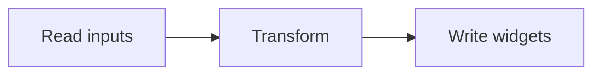

Widgetizer is a small pipeline. Understanding its three stages makes the
configuration options and CLI flags obvious.

## The pipeline



1. **Read** every file under the input directory into an in-memory record.
2. **Transform** each record into a widget, applying your configuration.
3. **Write** one output file per widget to the output directory.

## Purity and incremental builds

Each transform is a pure function of its input record plus the active
configuration. Because nothing reads the clock or a shared cache, building the
same input twice yields identical output. That property is what makes
`--incremental` safe: the tool can skip records whose inputs are unchanged and
still match a full rebuild byte-for-byte.

## Extending the pipeline

Rather than adding a flag for every need, Widgetizer exposes transform plugins.
A plugin declares what it contributes and stays out of the scheduling:

```python
def uppercase_labels(record, ctx):
    record["label"] = record["label"].upper()
    return record
```

Register it in your config and it runs as part of the transform stage. See the
[[Configuration reference]] for the registration syntax.
